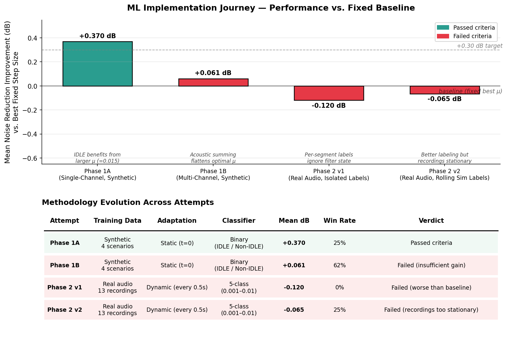

# Machine Learning Implementation Journey

## Goal of the ML Thread

We started with a working FxNLMS adaptive filter for Active Noise Control. The system worked well on synthetic noise (8–22 dB reduction) but struggled on real car recordings (<2 dB). The hypothesis was that **machine learning could intelligently select FxLMS hyperparameters** — particularly the step size (μ) — based on the current noise characteristics, doing better than any single fixed setting.

We made four iterative attempts to validate this hypothesis. None of them improved meaningfully over a well-tuned fixed-parameter baseline. This document explains what we tried, what we learned, and why the approach didn't work in our specific context.

---

## Attempt-by-Attempt Narrative

### Attempt 1 — Phase 1A: Single-Channel, Synthetic, Static Classification

**What we tried:** A binary neural network classifier (12 audio features → IDLE / Non-IDLE) trained on 600 samples from 4 synthetic driving scenarios (idle, city, highway, acceleration). At simulation start (t=0), classify the noise type and pick the optimal step size: μ=0.015 for IDLE, μ=0.005 for Non-IDLE.

**Result:** **+0.37 dB mean improvement, 25% win rate** ✅ — passed all criteria.

**What we learned:** ML can help when there's a real difference between optimal step sizes for different noise types. IDLE genuinely benefits from a faster step size (0.015) while busier scenarios prefer 0.005. Static classification is sufficient when the noise type doesn't change during operation.

### Attempt 2 — Phase 1B: Multi-Channel, Synthetic, Same Classifier

**What we tried:** Same model architecture, retrained on 4-speaker + 4-microphone configuration (matching realistic car installation). Reference signal is the average of 4 mics; anti-noise drives all 4 speakers identically.

**Result:** **+0.061 dB mean improvement, 62% win rate** ❌ — failed (target was +0.30 dB).

**What we learned:** Multi-channel acoustic summing fundamentally changes the optimal step-size landscape. With 4 speakers emitting identical anti-noise, the effective gain at the error mic is 4×, which makes aggressive step sizes unstable. All scenarios collapsed to preferring the same conservative μ=0.005, leaving almost no room for the classifier to make different recommendations. This was a humbling lesson: physics can erase the very signal ML is trying to learn.

### Attempt 3 — Phase 2 v1: Real Audio, Dynamic, Per-Segment Labels

**What we tried:** Pivoted to real car recordings (13 samples) where step-size optimum varies more (0.001–0.005 across recordings). Generated training data by chopping each recording into 1-second segments and, for each segment in isolation, running FxNLMS with all 5 candidate step sizes from a fresh state. Whichever step size produced the highest noise reduction on that 1-second chunk became the label. Dynamic adaptation: re-classify and re-set μ every 0.5s during simulation.

**Result:** **-0.12 dB mean (worse than baseline), 0/8 wins** ❌.

**What we learned:** The labeling was wrong. Per-segment evaluation in isolation ignores the fact that FxLMS runs **continuously** — the weights from second 1 feed into second 2. A step size that looks optimal on a 1-second snapshot in isolation might overshoot the weights, and that damage carries forward and harms the next 5+ seconds of operation. The training data was essentially mislabeled relative to the actual deployment task.

### Attempt 4 — Phase 2 v2: Real Audio, Dynamic, Rolling-Simulation Labels

**What we tried:** Fixed the labeling. Now training data comes from a **rolling simulation**: run a continuous baseline FxNLMS, save filter state at each 0.5s decision point, then for each step size run a 1-second lookahead from that exact state and evaluate noise reduction on the lookahead. The label captures the **downstream effect** of each step-size choice, not just its in-segment behavior.

**Result:** **-0.065 dB mean, 2/8 wins** ❌. Better label distribution (middle classes 0.003–0.007 now represented), better classifier behavior, still loses.

**What we learned:** The labeling fix was correct in principle but couldn't overcome a deeper limitation: **our 13-30 second test recordings are too stationary for dynamic adaptation to add value**. Within each clip, the noise characteristics don't change enough to justify switching the step size. The optimal strategy collapses to "find the best fixed μ for this recording and use it throughout."

---

## Key Insights

1. **Static classification only helps when noise type matters.** Phase 1A succeeded because IDLE truly differs from other scenarios. Phase 1B failed because acoustic summing flattened those differences.

2. **Multi-channel acoustics fundamentally change the optimization landscape.** Findings from a single-channel system don't transfer. We had to retrain and re-evaluate the entire pipeline for the multi-channel target configuration.

3. **Per-segment labeling ignores the cumulative effect on filter state.** Adaptive filters are stateful. Evaluating a hyperparameter in isolation gives the wrong answer for deployment in a continuous system. Rolling-simulation labels (with downstream lookahead) are required.

4. **FxLMS is itself a learning algorithm.** It already adapts its filter weights at every sample. Adding ML on top to choose its hyperparameters is *meta-learning*, and that only adds value if the optimal hyperparameters change faster than FxLMS can self-tune. For stationary noise within a clip, FxLMS's own adaptation handles the work, leaving little room for ML to contribute.

5. **Stationarity matters more than recording length.** Our recordings are short (13–30s) but more importantly they're **internally consistent** — single driving conditions captured for a short window. Dynamic ML adaptation needs *transitions* (idle → highway → city) to demonstrate value.

6. **Position optimization dwarfs algorithm/parameter tuning.** Moving the reference mic close to the noise source and the speaker close to the driver's ear improved noise reduction by **+6 to +8 dB**. The best ML attempt offered <0.1 dB. The hierarchy of impact for this system is clear: physics > placement > algorithm choice > parameter tuning > ML hyperparameter selection.

---

## What This Teaches

ML is a powerful tool but it isn't always the right tool. In this project, ML kept losing not because the implementations were wrong (the v2 model had correct labeling, balanced classes, reasonable validation accuracy of 52% on a 5-class problem) but because **the structure of the problem doesn't have ML-shaped slack to capture**. FxLMS already adapts at the sample level. The remaining headroom in our test data is too small for a classifier operating at 0.5-second granularity to exploit.

The lesson generalizes: before adding ML to a system that already contains an adaptive algorithm, ask whether the optimal control parameters change *faster* than the underlying algorithm can self-tune. If the answer is "no" — as it was here for short stationary recordings — then ML is solving the wrong problem.

---

## Where ML Could Still Help

We're not claiming ML can never help with ANC, only that step-size selection on stationary recordings isn't where ML shines. Three directions remain promising:

- **Long-form non-stationary scenarios.** Our v2 model was tested on short clips. Running the same model on the full 84-minute LA driving recording — which contains real transitions between city, highway, idle, and acceleration — could reveal genuine value. Dynamic adaptation needs transitions to matter.

- **Online secondary path identification.** FxLMS uses a *fixed* estimate of the speaker → error-mic acoustic path. Our 5% modeling error directly causes the waterbed effect (amplification at certain frequencies). ML or classical adaptive filtering could continuously refine this estimate during operation, addressing a real physics problem rather than tuning a hyperparameter.

- **Neural ANC.** Replace FxLMS entirely with a neural network that maps reference signal → anti-noise sample. This is a fundamentally different architecture, capable of learning nonlinear relationships FxLMS cannot represent. Higher uncertainty but bigger ceiling if it works.

---

## File Map

| Artifact | Purpose |
|----------|---------|
| `output/plots/ml_journey.png` | Visualization of the four attempts |
| `scripts/plots/plot_ml_journey.py` | Plot generation script |
| `docs/ml_journey.md` | This document |
| `docs/phase1_summary.md` | Detailed Phase 1A/1B results |
| `docs/real_life_sounds.md` | Real audio analysis and parameter sweeps |
| `docs/position_optimization.md` | Why positions matter more than algorithms |
| `output/models/phase1/step_selector_binary.pt` | Phase 1B trained model |
| `output/models/phase2/dynamic_step_selector.pt` | Phase 2 v2 trained model |
| `output/data/phase2/dynamic_step_training_data_v2.json` | Phase 2 v2 training set (rolling-sim labels) |
